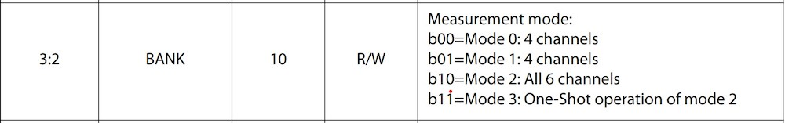

# Integrated Sensors

## Einleitung - Vision - Motivation

Unsere Motivation ist es ein portables Messsystem zu bauen, welches überall genutzt werden kann, um Spektren von Objekten zu messen.
Ableitend dazu ist das Ziel unseres Projekts, ein transportables, handliches (Stempel-) Messsystem mit dem Spektral-Sensor AS7265x zu erstellen, welches die gemessenen Daten in einer Datenbank speichert und grafisch visualisiert.

Mit diesem Messsystem soll es möglich sein unterwegs, beispielsweise im Baumarkt oder Supermarkt, verschiedene Produkte zu scannen.
Aus den beim Scan-Vorgang erhaltenen Daten, sollen anschließend Aussagen über die Eigenschaften des Produktes gemacht werden.

Damit Eigenschaften zu den Produkten ermittelt werden können, muss zunächst eine Datenbank mit Messdaten von ausgewählten Produkten aufgebaut werden.
Durch vergleichen der Datensätze sollen darauffolgend, die Aussagen über die Produkteigenschaften erzeugt werden.

In dieser Dokumentation werden zunächst allgemeine Informationen über die verwendeten Technologien/Hardware aufgezeigt.
Dazu werden außerdem einige Basisinformationen wiedergegeben.

Im Anschluss werden die zwei Projektaufbauten näher beleuchtet.
Der zweite Projektaufbau ist in 3 Stages unterteilt, welche jeweils einem Zwischenergebnis entspricht.

## AS7265x

### Aufbau des Sensors

Der Sensor besitzt drei separate Spektral-Sensorchips (AS72651, AS72652, AS72653).
Jeder Sensorchip besitzt eine ansteuerbare LED, welche sich in den Zwischenräumen der einzelnen Chips befinden.
Im Weiteren besitzt jeder Chip einen eingebauten Temperatursensor.
Für eine akkurate Messung werden die LEDs benötigt, da diese das benötigte Lichtspektrum erzeugen.
Bei diesem Vorgang wird das erzeugte Licht auf das Objekt gestrahlt und die reflektierte Strahlung gemessen.
Dieses Prinzip wird "Reflektrometrie" genannt.
Jeder der drei Spektral-Sensorchips besitzt 6 Kanäle, welche einen Teil des Lichtspektrums abdecken.
Zusammen decken sie das Spektrum des sichtbaren Lichtes ab, vom nahem infrarot Licht bis hin zu ultraviolettem Licht.
Die Sensor-Chips kommunizieren untereinander über das I²C Protokoll.
Der erste der drei Sensor-Chips (AS72651) ist dabei der Master und die anderen beiden (AS72652, AS72653) sind die Slaves des I²C Busses.

Alle drei Sensor-Chips besitzen virtuelle Adressen ihrer Kanäle, die mit I²C angesteuert werden können.
Im Kapitel [Stage1](files/stage1.md) wird mit Hilfe von Code näher darauf eingegangen.
Die externe Kommunikation läuft dabei ausschließlich über den Master Chip AS72651, welcher Informationen der Slaves nach Bedarf bereitstellt.
Es ist nicht bekannt, wie die Bereitstellung der Daten intern über I²C funktioniert.

Betrieben wird der Sensor mit 3,3 Volt.

- Datenblatt: [AS7265x](https://cdn.sparkfun.com/assets/c/2/9/0/a/AS7265x_Datasheet.pdf)
- Hersteller Website: [SparkFun Triad Spectroscopy Sensor - AS7265x (Qwiic)](https://www.sparkfun.com/products/15050)


### Bank Modes

Jeder Chip besitzt zwei Photodioden-Banken, welche die gemessenen Werte beinhalten.
Nachdem eine Messung durch das Konfigurationsregister ausgelöst wird, werden die dazugehörigen Werte in den Photodioden-Banken bereit gestellt.
Dafür werden die Werte aus den Photodioden-Banken mit A/D-Wandler umgewandelt und in die korrespondierenden Kanäle/Register gespeichert.
Dabei können vier Kanäle auf einmal integriert werden, weshalb bei einer vollen Messung von sechs Kanälen zwei Integrationszyklen notwendig sind.


Welcher Wert für den Integrationszyklus benutzt wird und wie die Berechnung dafür aussieht, wird im Rahmen des Projektes nicht weiter verfolgt.
Im Rahmen dieses Projektes wird der vordefinierte Wert aus der Bibliothek verwendet.
Der genaue Wert kann aus dem Datenblatt entnommen werden.

Je nachdem welcher Modus im Konfigurationsregister gesetzt ist, stehen unterschiedliche Sensorwerte zur Verfügung.
Dabei sind zwischen drei Modi zu unterscheiden, welche jeweils ein anderes Bit-Muster initiieren.



Für die Bit-Muster ```0b00``` und ```0b01``` wird der selbe Modus initiiert.
Für die komplette Messung aller 18 Kanäle muss der letzte Modus gewählt werden.

Wie genau die Messung erfolgt und wie die Werte in die jeweiligen Photodioden-Banken gespeichert werden, konnte aus dem Datenblatt nicht entnommen werden.

### LED Control

Jeder Chip besitzt zwei integrierte LED Treiber, mit programmierbarer Stromstärke.
Für akkuratere Messungen haben wir die beiden LED's, Status und PWR (Power), ausgeschaltet.
Diese würden ansonsten zu weiteren Reflektionen führen, welche die gemessenen Werte verfälschen würden.
Die Status LED konnte im Code, durch das aufrufen der Methode **disableIndicator()** ausgeschaltet werden.
Für die PWR LED wurde der Jumper, welcher sich links neben der LED befindet, durchtrennt.


Im Projekt wird nicht näher auf die Kontrolle der LED's eingegangen, sondern lediglich die Default-Optionen der Bibliothek verwendet,
da diese nicht relevant waren.

## Was ist InfluxDB?

InfluxDB ist ein Open-Source-Datenbankmanagementsystem, das von der Firma InfluxData entwickelt wurde und speziell für die Speicherung von Zeitreihen gedacht ist.
Dazu gehören APIs zum Speichern und Abfragen von Daten, deren Verarbeitung im Hintergrund für Überwachungs- und Warnzwecke, Benutzer-Dashboards sowie die Visualisierung und Untersuchung der Daten.
Um mit dem Datenbankmanagementsystem zu interagieren besitzt es zwei Abfragesprachen.
Eine funktionale Skriptsprache Flux und eine SQL ähnliche Sprache InfluxQL, welche, wie die Weboberfläche, auf Port 8086 angesprochen wird.

## Was ist Grafana?

Grafana ist eine Open-Source-Anwendung für Analysen und interaktive Visualisierung.
Es bietet Diagramme, Grafiken und Warnungen, wenn es mit unterstützten Datenquellen verbunden ist.
Mithilfe von Plugins können die Anzeigemöglichkeiten auf Dashboards und Datenquellen erweitert werden.
Dashboards können mit interaktiven Abfragegeneratoren erstellt werden.
"Grafana wird häufig für Überwachungsanwendungen verwendet und unterstützt die drei Säulen der Observability: Metriken, Logging und Tracing, kann aber auch zur Darstellung von statischen Daten in relationalen Datenbanken genutzt werden." Quelle [Wikipedia](https://de.wikipedia.org/wiki/Grafana) (13.1.23)
